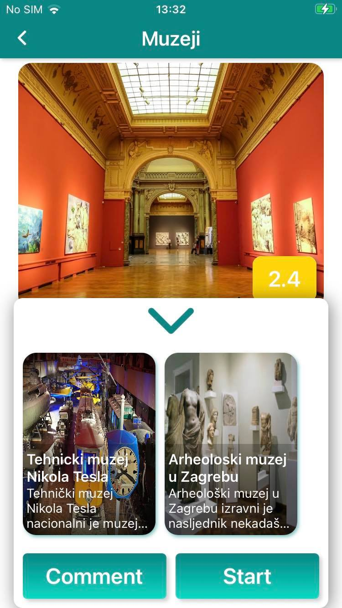
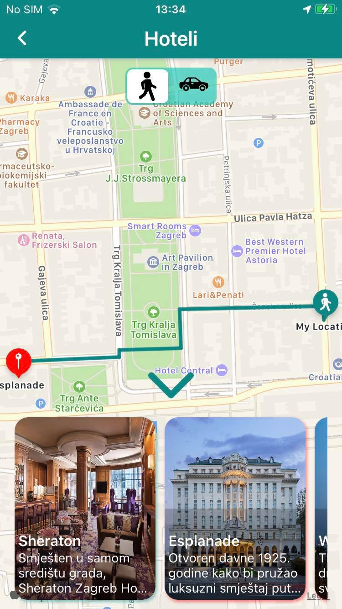
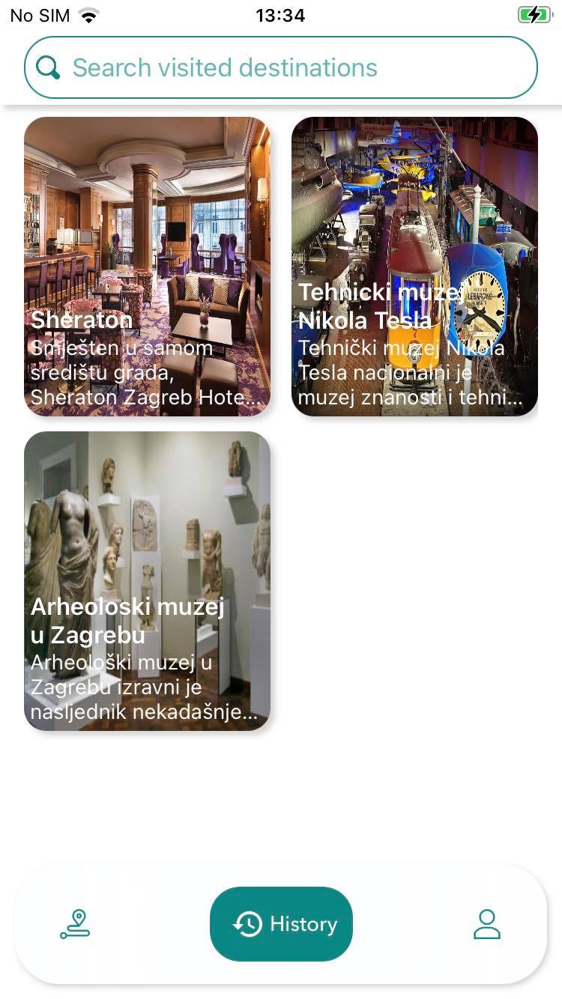

# eTurist

## Scrennshots
      

## Description
eTurist is iOS app that shows user list of available routes in current city. Each route contains a list of destinations to visit, and map directions how to get there.
User can see route and destination details, comment on both and leave a rating on route.

Application is written in swift without using storyboards. It follows MVVM architecture and coordinator pattern.
